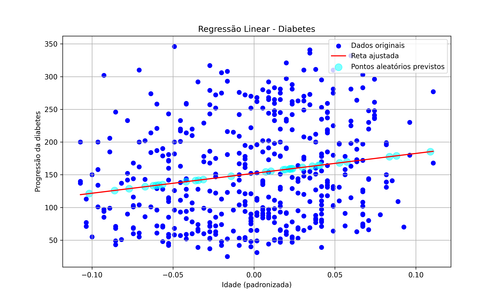

# Regressão Linear - Diabetes

Este projeto demonstra uma **regressão linear simples** utilizando o dataset `diabetes` do `scikit-learn`.  
O objetivo é prever a **progressão da diabetes** de pacientes com base na **idade**.

---

## Dataset

- Dataset: `diabetes` do `scikit-learn`  
- Feature: `age` (idade dos pacientes, padronizada)  
- Target: `target` (progressão quantitativa da diabetes 1 ano após o início do estudo)  
- Número de amostras: 442  

---

## Objetivos do projeto

- Treinar um modelo de regressão linear simples  
- Visualizar a reta ajustada com os dados originais  
- Gerar 30 pontos aleatórios de idade e prever o target correspondente  
- Plotar os resultados para análise visual  

---

## Como rodar

1. Clone o repositório:

```bash
git clone https://github.com/klayveralencar777/A-simple-linear-regression


